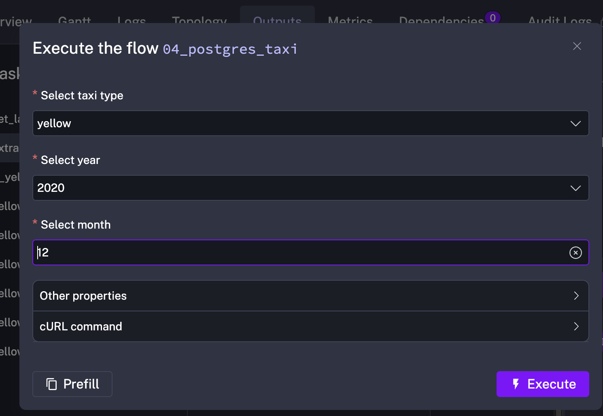
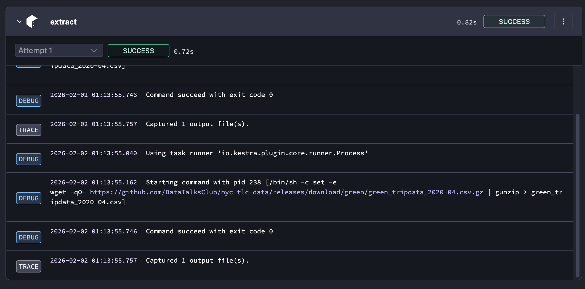
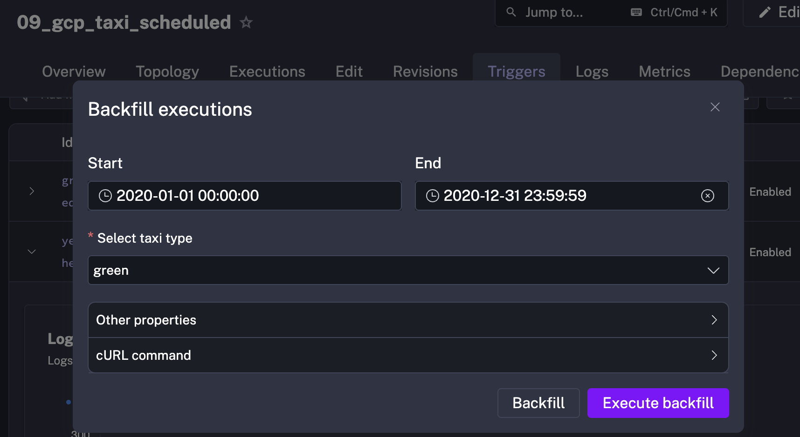
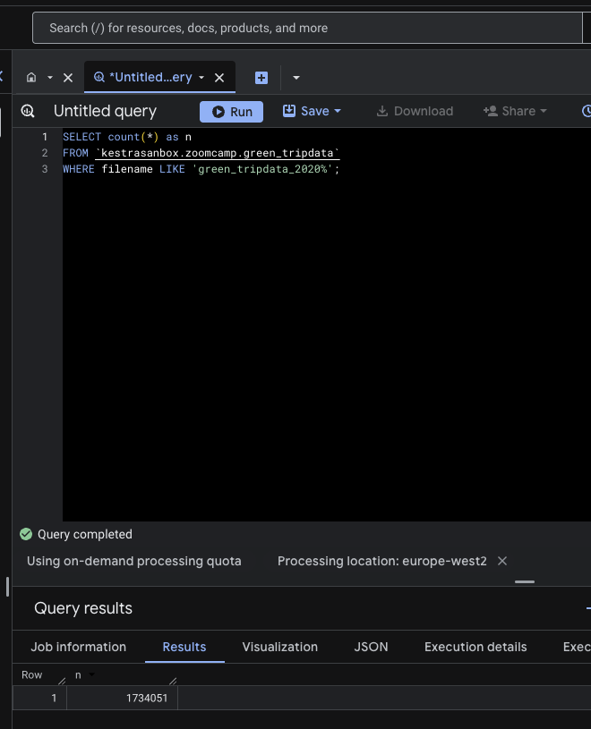
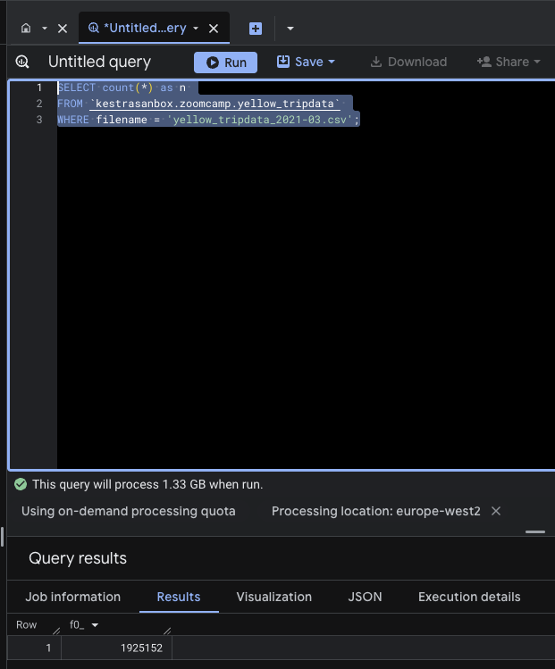
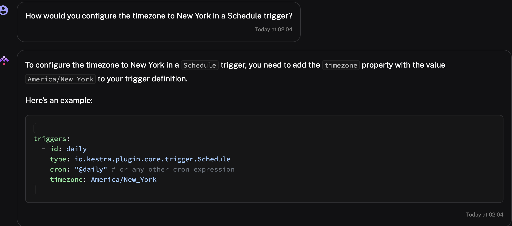

# 📊 NYC Taxi Data Pipeline - Module 2 Homework

This repository contains my solution for the **Data Engineering Zoomcamp 2026 - Module 2**, focusing on Workflow Orchestration with **Kestra**.

The goal of this assignment was to manage and orchestrate an ETL pipeline for the NYC Taxi dataset (Yellow and Green) using Google Cloud Platform and Kestra's advanced features like backfilling and scheduling.

## 🚀 Key Implementation Details

* **Workflow Orchestration**: Built robust Kestra flows to automate data extraction, transformation, and loading (ETL).
* **Infrastructure as Code (IaC)**: Configured the local environment using **Docker Compose**, including a Kestra instance with **Gemini AI Copilot** integration.
* **Secure Variable Management**: Utilized Kestra's **KV Store** to securely manage GCP project IDs, dataset locations, and credentials.
* **Data Backfill**: Performed a full backfill for the year 2020-2021 for both taxi services, ensuring data consistency across multiple months.

## 📝 Quiz Results Summary

Based on the pipeline executions and BigQuery analysis, here are the findings for the homework assignment:

1. **Yellow Taxi (Dec 2020) Size**: 128.3 MiB.


2. **Rendered File Name**: `green_tripdata_2020-04.csv`.

3. **Yellow Taxi 2020 Row Count**: 24,648,499.
Flows -> 09_gcp_taxi_scheduled->triggers -> From 01/01/2020 to 31/12/2020 
```SQL
SELECT count(*)  
FROM `kestrasanbox.zoomcamp.yellow_tripdata`  
WHERE filename LIKE 'yellow_tripdata_2020%'; 
```  
 

4. **Green Taxi 2020 Row Count**: 1,734,051.
```SQL
SELECT count(*) as n  

FROM `kestrasanbox.zoomcamp.green_tripdata`  

WHERE filename LIKE 'green_tripdata_2020%'; 
```  
 
 

5. **Yellow Taxi March 2021 Row Count**: 1,925,152.
```SQL
SELECT count(*) as n  

FROM `kestrasanbox.zoomcamp.yellow_tripdata`  

WHERE filename = 'yellow_tripdata_2021-03.csv'; 
```   
 

6. **Timezone Configuration**: Used `America/New_York` for accurate scheduling.
 

