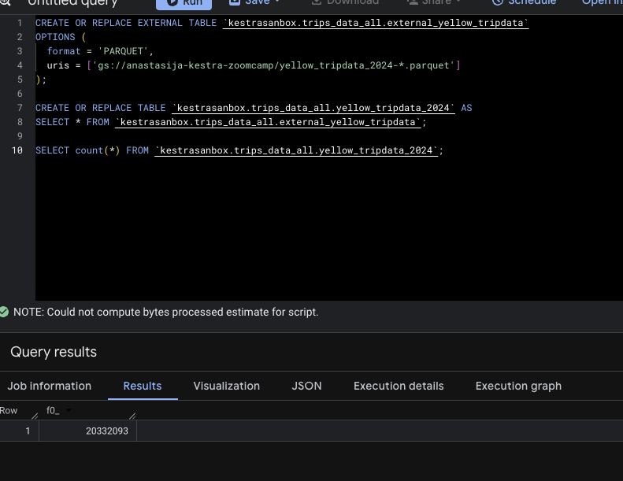
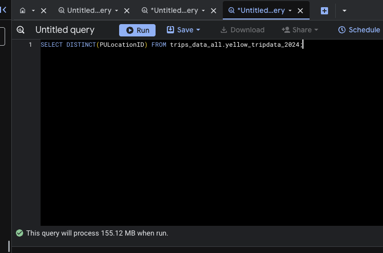
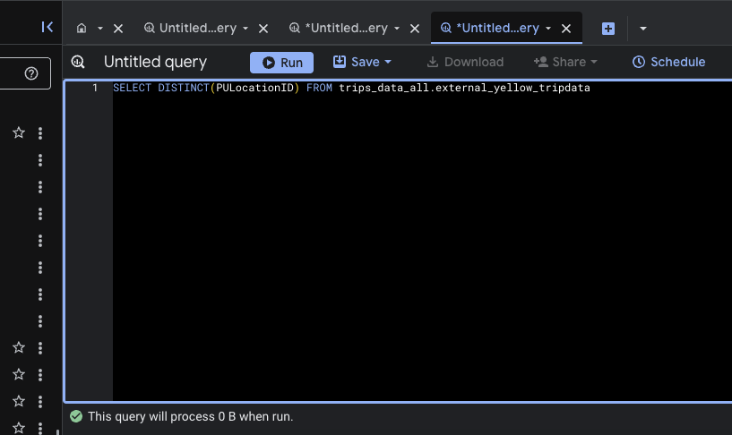
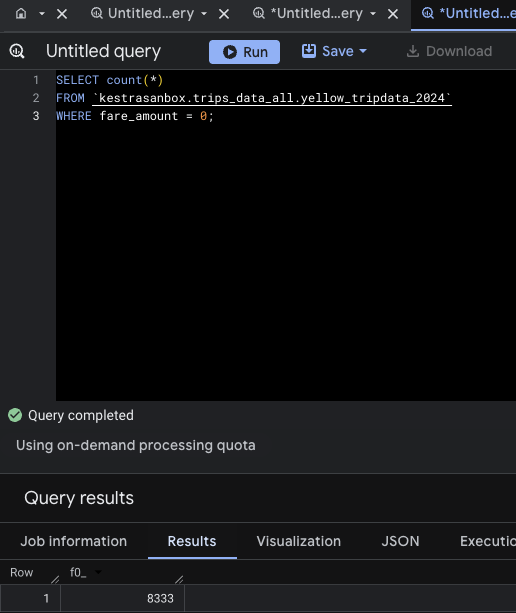
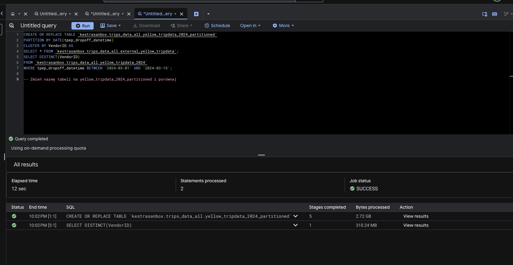

# 📊 NYC Taxi Data Pipeline - Module 3: Data Warehousing & BigQuery

This repository contains my solution for **Module 3** of the Data Engineering Zoomcamp 2026. This module focused on advanced BigQuery features, storage optimization, and efficient data orchestration.

## 🎓 Learning Objectives
* **Data Warehouse Fundamentals**: Understanding the architecture of BigQuery and its separation of storage and compute.
* **Storage Optimization**: Implementing Partitioning and Clustering to reduce query costs and increase performance.
* **External vs. Native Tables**: Leveraging Google Cloud Storage (GCS) as an external data source for BigQuery.
* **Columnar Storage**: Analyzing how BigQuery's storage engine handles data retrieval at scale.

## 🚀 Key Implementation Details

* **Orchestration with Kestra**: Created automated flows to extract Yellow Taxi Parquet data for 2024 (January to June) from the NYC TLC website and load it into Google Cloud Storage.
* **Infrastructure as Code (IaC)**: Deployed a local environment using **Docker Compose**, running Kestra to manage the ETL pipeline.
* **Multi-Cloud Setup**: Configured a secure connection between Kestra and **Google Cloud Platform (GCP)** using Service Account keys and Kestra's **KV Store** for secure variable management.
* **Regional Data Management**: Handled regional data constraints by aligning the **GCS Bucket** and **BigQuery Dataset** within the `europe-west2` (London) region to ensure high availability and compatibility.

---

## 📝 Quiz Results & Technical Analysis

### Question 1. Record Count for 2024 Yellow Taxi Data
--- 
```sql
SELECT count(*) FROM `kestrasanbox.trips_data_all.yellow_tripdata_2024`; 
```SQL
SELECT count(*) 
FROM `kestrasanbox.trips_data_all.yellow_tripdata_2024`;  
```
Answers; 20 332 093



### Question 2. What is the estimated amount of data that will be read when this query is executed on the External Table and the Table? 
--- 
For Materialized; 
```SQL
SELECT DISTINCT(PULocationID) FROM trips_data_all.yellow_tripdata_2024;'
```


For External 
```SQL
SELECT DISTINCT(PULocationID) FROM trips_data_all.external_yellow_tripdata;
```


Materialized Table: Estimated 155.12 MB

External Table: Estimated 0 MB (due to BigQuery's lazy evaluation of external Parquet files metadata).
 
### Question 3. Why are the estimated number of Bytes different? 
--- 
Answer: BigQuery is a columnar database. Unlike traditional row-oriented databases (like PostgreSQL or MySQL) that read entire rows of data, BigQuery stores each column in separate storage blocks.

Observations from our lab:

Single Column Query (PULocationID): BigQuery only scans the specific blocks associated with that column. For our dataset, this was estimated at 155.12 MB.

Two Column Query (PULocationID & DOLocationID): The system must read two distinct sets of files from storage, doubling the amount of data processed to approximately 310 MB.

Key Takeaways for Data Engineers:

Cost Efficiency: Avoid SELECT *. Since BigQuery charges per byte processed, only selecting the columns you need directly reduces your cloud bill.

I/O Optimization: By reading fewer columns, you reduce the Input/Output operations, leading to significantly faster query execution.

Better Compression: Because data in a single column is often similar (e.g., a column of IDs), columnar storage allows for much higher compression ratios compared to row-based storage.

### Question 4. How many records have a fare_amount of 0? 
---  
```SQL

SELECT count(*) 
FROM `kestrasanbox.trips_data_all.yellow_tripdata_2024` 
WHERE fare_amount = 0;
```
Answer; 8333 




### Question 5. Partitioning and Clustering Strategy 
---  
🚀 Table Optimization: Partitioning vs. Clustering (Question 5)
When designing tables in BigQuery for large-scale data, choosing the right optimization strategy is critical for performance and cost reduction.

The Challenge
Our goal was to optimize a table where queries frequently:

Filter by tpep_dropoff_datetime.

Order results by VendorID.

The Solution: Partitioning + Clustering
The best strategy is to Partition by tpep_dropoff_datetime and Cluster on VendorID.

Partitioning (by Date): * BigQuery physically divides the table into segments based on the date.

When a query filters by date, BigQuery "prunes" (skips) all partitions that don't match the criteria, drastically reducing the amount of data scanned and the cost.

Clustering (by VendorID): * Inside each date partition, BigQuery co-locates and sorts the data by VendorID.

This makes operations like sorting (ORDER BY) or grouping (GROUP BY) much faster and more efficient.

Key Takeaway
"Partition on the filter, Cluster on the sorter." By combining both, we ensure that BigQuery only reads the necessary dates and can quickly jump to the specific Vendors within those dates.

### Question 6.Partitioning Benefits (Performance Benchmark) 
---  
Write a query to retrieve the distinct VendorIDs between tpep_dropoff_datetime 2024-03-01 and 2024-03-15 (inclusive). Use the materialized table you created earlier in your from clause and note the estimated bytes. Now change the table in the from clause to the partitioned table you created for question 5 and note the estimated bytes processed. What are these values?  

Scenario: Retrieving distinct VendorIDs between 2024-03-01 and 2024-03-15.

Non-partitioned table: 310.24 MB

Partitioned table: 26.84 MB Result: ~91% reduction in data processed! 
Step 1;
```SQL
 
CREATE OR REPLACE TABLE `kestrasanbox.trips_data_all.yellow_tripdata_2024_partitioned`
PARTITION BY DATE(tpep_dropoff_datetime)
CLUSTER BY VendorID AS
SELECT * FROM `kestrasanbox.trips_data_all.external_yellow_tripdata`;
``` 
Step 2; 
```SQL
 
SELECT DISTINCT(VendorID)
FROM `kestrasanbox.trips_data_all.yellow_tripdata_2024`
WHERE tpep_dropoff_datetime BETWEEN '2024-03-01' AND '2024-03-15';
```  
Answer;310.24 MB.

```SQL
 
SELECT DISTINCT(VendorID)
FROM `kestrasanbox.trips_data_all.yellow_tripdata_2024_partitioned`
WHERE tpep_dropoff_datetime BETWEEN '2024-03-01' AND '2024-03-15';
```  
Answer;26.84 MB.


### Question 7.  Where is the data stored in the External Table you created? 
---  
Answer;GCP Bucket 
Technical Explanation:
An External Table in BigQuery acts only as a metadata layer or a "window." When you create an external table, BigQuery does not move or ingest the data into its own internal storage.

Storage (GCP Bucket): The physical files (in this case, .parquet files for the 2024 Yellow Taxi data) remain in their original location within Google Cloud Storage (GCS).

Compute (BigQuery): When you run a query, BigQuery reads the data directly from the bucket on-the-fly.

Contrast with Native Tables: In a standard (materialized) table, BigQuery copies the data into its own proprietary storage format. For external tables, BigQuery simply "points" to the files in your bucket.

Why this matters for Data Engineering:
Cost: You don't pay for BigQuery storage for these files; you only pay for GCS storage.

Decoupling: It allows you to use the same data files with other tools (like Spark or Python scripts) simultaneously, as the data is not locked inside BigQuery's internal ecosystem.

### Question 8. It is best practice in Big Query to always cluster your data  
---   

Technical Explanation:
While clustering is a powerful tool for performance optimization, it is not a "one-size-fits-all" solution. Using it on every single table can actually be counterproductive for several reasons:

Table Size Matters: Clustering provides the most significant benefits for large tables (usually > 1 GB). For small tables, the overhead of managing metadata for clusters can exceed the time saved during query execution.

Maintenance Costs: Clustering is a metadata-heavy operation. For tables that are updated very frequently with small amounts of data, the background "re-clustering" process (done automatically by Google) might not be efficient.

Query Patterns: If you don't have a consistent column used for filtering or ordering (e.g., your queries are always different), clustering won't help. Clustering is only effective when you consistently filter by the same specific columns (like VendorID or LocationID).

Automatic Re-sorting: Unlike partitioning, clustering is not a hard "guarantee" of order. BigQuery sorts data in the background. If the table is too small, BigQuery might decide that a full table scan is faster than navigating the cluster metadata.

Key Takeaway for Developers:
Clustering should be a deliberate choice. Only apply clustering when your tables are large and you have identified specific columns that appear frequently in your WHERE or ORDER BY clauses.

### Question 9: Why does SELECT count(*) process 0 bytes?
--- 
Observation: When running a SELECT count(*) on a materialized (native) table, BigQuery estimates that 0 bytes of data will be processed.


The Reason: BigQuery maintains metadata for all its native tables. Metadata is a small, separate file that stores high-level information about the table, such as:
Total row count.
Table creation time.
Schema details.

Instead of scanning every row in the table to count them, BigQuery simply reads the pre-calculated row count from its metadata repository. Since it doesn't need to touch the actual data blocks (the columns) stored on disk, the cost in terms of bytes processed is zero.
